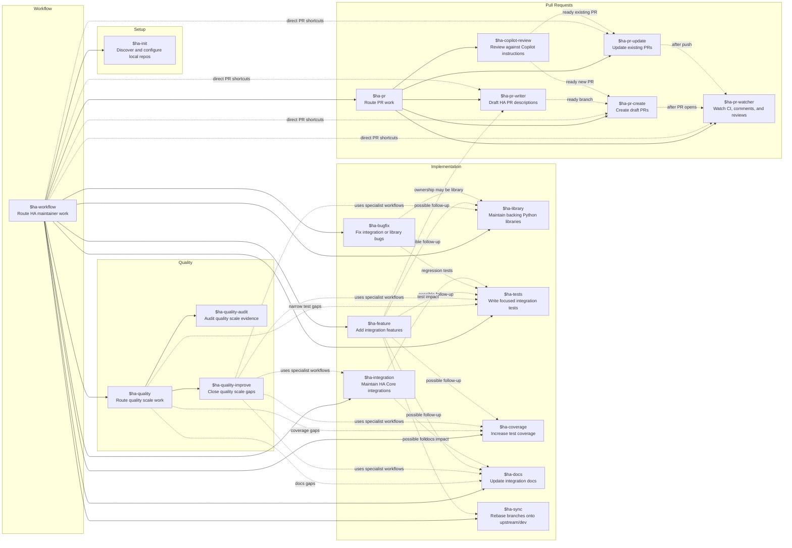

# Agent Matrix

This Mermaid diagram shows the current routing hierarchy for the HA skill bundle.

Solid edges are primary routing relationships. Dashed edges are direct workflow shortcuts or cross-workflow follow-ups documented in the skills.

When adding, renaming, or removing a skill, update this diagram and the README skill list in the same change.
